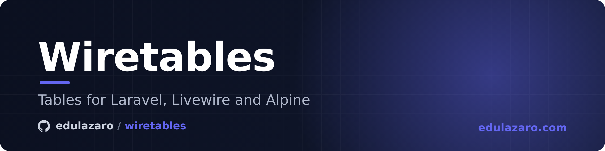

# wiretables

Tables for Laravel, Livewire and Alpine: Blade components that read the same on a phone and on a desktop, header sorting, and a row actions menu that opens above everything, so no scrolling table or modal cuts it off. Pure CSS, no Tailwind or Bootstrap needed. Part of the `wire*` family: themeable through the shared `data-wire-theme` attribute, visually coherent with [wiremodal](https://github.com/edulazaro/wiremodal), [wiretoast](https://github.com/edulazaro/wiretoast), [wirepicker](https://github.com/edulazaro/wirepicker), [wirecookies](https://github.com/edulazaro/wirecookies) and [wirebug](https://github.com/edulazaro/wirebug).

Blade markup you write · columns that hide or stack into cards · sorting · load more · row actions menu · 12 themes · 0 runtime deps.

It is not a table engine configured from PHP arrays: each table is written in Blade, cell by cell, so a cell that needs something unusual is just Blade. The package brings the pieces, their look, and the behaviour every list repeats.

## Install

```bash
composer require edulazaro/wiretables
php artisan vendor:publish --tag=wiretables-assets
```

Add to your layout, the core and, if you want one, a theme:

```blade
<link rel="stylesheet" href="{{ asset('vendor/wiretables/css/wiretables-core.css') }}">
<link rel="stylesheet" href="{{ asset('vendor/wiretables/css/themes/studio.css') }}">
```

Or import into your Vite bundle:

```css
@import "../../vendor/edulazaro/wiretables/resources/css/wiretables-core.css";
@import "../../vendor/edulazaro/wiretables/resources/css/themes/studio.css";
```

`wiretables.css` holds the core and every theme in one file, for when you would rather not choose. Adding themes to the package never makes `wiretables-core.css` bigger.

The row menu needs Alpine with its anchor plugin, both bundled with Livewire 3 and 4.

## A table

```blade
<x-wiretable>
    <x-slot:head>
        <x-wiretable.th>Event</x-wiretable.th>
        <x-wiretable.th hide="sm" shrink>Status</x-wiretable.th>
        <x-wiretable.th hide="md" shrink>Date</x-wiretable.th>
        <x-wiretable.th actions />
    </x-slot:head>

    @forelse ($projects as $project)
        <x-wiretable.row wire:key="project-{{ $project->id }}">
            <x-wiretable.td>
                <x-wiretable.primary :title="$project->name" :subtitle="$project->email" :href="route('projects.show', $project)">
                    {{-- What the hidden columns show on a phone. --}}
                    <p class="md:hidden">{{ $project->status }} · {{ $project->date }}</p>
                </x-wiretable.primary>
            </x-wiretable.td>
            <x-wiretable.td hide="sm" shrink>{{ $project->status }}</x-wiretable.td>
            <x-wiretable.td hide="md" shrink>{{ $project->date }}</x-wiretable.td>
            <x-wiretable.td actions>
                <x-wiretable.menu :label="'Actions of '.$project->name">
                    <x-wiretable.menu-item :href="route('projects.show', $project)">Open</x-wiretable.menu-item>
                </x-wiretable.menu>
            </x-wiretable.td>
        </x-wiretable.row>
    @empty
        <x-wiretable.empty colspan="4">Nothing yet.</x-wiretable.empty>
    @endforelse
</x-wiretable>
```

The first column holds the record and takes the room left; the rest fit their content (`shrink`). A column with `hide="md"` shows from that breakpoint up (`sm`, `md`, `lg`, `xl`, Tailwind's widths), and its `th` and `td` take the same value. Nothing scrolls sideways: what a phone cannot show, the first cell repeats in its slot.

Figures and amounts take `align="right"` on both the `th` and the `td`; a sortable header keeps its arrow on the inner side.

A cell that can hold anything, a name, an address, a note, takes `truncate`, and its text is cut with an ellipsis instead of widening the column:

```blade
<x-wiretable.th truncate>Address</x-wiretable.th>
<x-wiretable.td truncate>{{ $client->address }}</x-wiretable.td>
```

It goes on both, since in a table the widest cell of a column decides how wide the column is. The column then takes its share of the table's width, so one long value no longer pushes the table past the screen. In a stacked card it undoes itself, because there the text is read whole. `<x-wiretable.primary>` already cuts its title this way, with no attribute.

## A footer

Pagination, totals or anything else under the rows goes in the `footer` slot, inside the frame:

```blade
<x-wiretable>
    …
    <x-slot:footer>
        {{ $projects->links() }}
    </x-slot:footer>
</x-wiretable>
```

## On a phone

Two ways, chosen per table.

**Columns that hide** (the default): each column shows from its `hide` breakpoint up, and the first cell repeats what a phone cannot see. Best for tables with a few columns that matter.

**Rows that stack into cards**: `stack="md"` turns each row into a card below that width, and each cell becomes a line with its `label` above it. Best when every value matters on a phone too.

```blade
<x-wiretable stack="md" expandable>
    …
    <x-wiretable.row wire:key="…">
        <x-wiretable.td label="Property">…</x-wiretable.td>
        <x-wiretable.td hide="md" label="Price" align="right">…</x-wiretable.td>
        <x-wiretable.td actions>…</x-wiretable.td>
    </x-wiretable.row>
</x-wiretable>
```

With `expandable`, the cells that have `hide` fold away in the card and a button in the actions cell unfolds them, one row at a time. On a desktop nothing changes.

Add `compact` for a denser card: the cells without `hide` and the actions share one line, and the cells with `hide` go below it, folded with `expandable`. Leave out their `label` for plain lines.

## Inside a card

`flush` drops the frame (ground, line and radius) and puts the first and last columns against the edges, for a table that already sits in a card of its own, such as a dashboard panel.

## Separated rows

`rows="separated"` draws each row as a card of its own, with a little room between them, instead of one frame with lines. `--wtb-row-gap` sets the room. It combines with `stack`.

## The first cell

`<x-wiretable.primary>` is the record: its name as a link (`href`), as a button running an Alpine expression (`action`, to open it in place), or as plain text; a muted `subtitle`; a `leading` slot for an avatar or a thumbnail; and, in its default slot, whatever the hidden columns show on narrow screens. On a desktop, hovering the row underlines the name.

```blade
<x-wiretable.primary :title="$user->name" :subtitle="$user->email" action="$dispatch('user-open', { id: {{ $user->id }} })">
    <x-slot:leading>avatar }}" alt="" width="32" height="32"></x-slot:leading>
</x-wiretable.primary>
```

## Clickable rows

Give the row an `href` (with `navigate` for no reload) or an `action` (an Alpine expression) and the whole row opens it. Everything interactive inside keeps working on its own: the row menu, a link in a cell, a checkbox, a select. A click that ends a text selection does nothing, Ctrl, Cmd or the middle button open the `href` in a new tab, and the row is reachable with Tab and opens with Enter.

```blade
<x-wiretable.row :href="route('clients.show', $client)" navigate wire:key="client-{{ $client->id }}">
    …
</x-wiretable.row>

<x-wiretable.row action="$wire.edit({{ $rule->id }})">
    …
</x-wiretable.row>
```

Anything else that should not open the row takes `data-wtb-ignore`.

## Sorting

Give a header a `sortable` key and the component's `sort` and `direction`, and it becomes a button that shows the order it is in:

```blade
<x-wiretable.th hide="md" shrink sortable="date" :sort="$sort" :direction="$direction">Date</x-wiretable.th>
```

The Livewire side is the `WithSorting` trait: it holds `sort` and `direction` (in the URL, so a sorted list can be reloaded or shared), and its `sortBy()` cycles ascending, descending and back to the list's own order, then goes back to the first page. Only the keys `sortable()` returns are accepted, since the client can send any string:

```php
use EduLazaro\Wiretables\Concerns\WithSorting;

class Projects extends Component
{
    use WithPagination, WithSorting;

    protected function sortable(): array
    {
        return ['date', 'received'];
    }

    public function render()
    {
        $column = ['date' => 'starts_on', 'received' => 'created_at'][$this->sort] ?? null;

        $projects = Project::query()
            ->when($column, fn ($query) => $query->orderBy($column, $this->direction))
            ->paginate(25);

        return view('livewire.projects', compact('projects'));
    }
}
```

The query maps the key to a column itself. A header can call another method with `method="order"`.

## Load more

For a list that grows instead of paging, `WithLoadMore` and `<x-wiretable.load-more>`:

```php
use EduLazaro\Wiretables\Concerns\WithLoadMore;

class Properties extends Component
{
    use WithLoadMore;

    protected function perLoad(): int
    {
        return 30;
    }

    public function render()
    {
        return view('livewire.properties', [
            'properties' => $this->loadMoreFrom(Property::query()->latest()),
        ]);
    }
}
```

```blade
<x-wiretable>
    …
</x-wiretable>
<x-wiretable.load-more :show="$hasMore" />
```

Each read asks for everything up to the current page from the start, rather than skipping what was loaded: a record added or removed meanwhile would otherwise shift the offset and repeat or lose rows. The page count is locked, so the client cannot ask for a thousand rows at once. Any property update (a filter, the search) and any new order (`WithSorting`) start again from the first page. The button is busy while the next page comes.

## The row menu

`<x-wiretable.menu :label="…">` is the row's "⋯": a button and a menu of actions.

```blade
<x-wiretable.menu :label="'Actions of '.$project->name">
    <x-wiretable.menu-item :href="route('projects.show', $project)">
        <x-slot:leading><svg>…</svg></x-slot:leading>
        Open
    </x-wiretable.menu-item>
    <x-wiretable.menu-item wire:click="duplicate({{ $project->id }})">Duplicate</x-wiretable.menu-item>
    <x-wiretable.menu-separator />
    <x-wiretable.menu-item wire:click="confirmDelete({{ $project->id }})" danger>Delete…</x-wiretable.menu-item>
</x-wiretable.menu>
```

A `menu-item` is a link with `href` and a button otherwise (`wire:click`, `x-on:click`); `leading` holds an icon (18 px) or a dot before the text, and `danger` paints what destroys or cannot be undone. `menu-separator` splits the groups. The menu is moved to `<body>` and anchored to its button, so a table that scrolls, a card or a modal never clips it; choosing an item, a click outside or Escape closes it. Actions per row live here rather than as loose buttons, which do not fit on a phone.

## Lists without column headers

When each record reads as a card rather than a row of columns (a title with badges, a muted line, a status on the right), or for a grid of cards, use [wirelist](https://github.com/edulazaro/wirelist): built on this package, with the same look, menu, load more and themes.

## Options

| Component | Attribute | |
|---|---|---|
| `x-wiretable` | `stack` | `sm`, `md`, `lg` or `xl`: below it, rows become cards |
| | `expandable` | With `stack`, the cells with `hide` fold behind a button |
| | `compact` | With `stack`, the main cells and the actions on one line |
| | `rows` | `separated`: each row a card of its own |
| | `flush` | No frame, for a table inside a card |
| | slot `footer` | Under the rows, inside the frame |
| `x-wiretable.th` | `hide` | `sm`, `md`, `lg` or `xl`: the breakpoint from which the column shows |
| | `shrink` | As wide as its content |
| | `actions` | The narrow last column; its text is for screen readers only ("Actions" by default) |
| | `align` | `right` for figures and amounts |
| | `sortable`, `sort`, `direction`, `method` | Header sorting, above |
| `x-wiretable.td` | `hide`, `shrink`, `actions`, `align` | The same as its column's header |
| | `label` | What the cell is, shown above it when the table stacks |
| `x-wiretable.primary` | `title`, `subtitle`, `href`, `action`, `navigate` | The record, above (`navigate` adds `wire:navigate`); slots `leading` and default |
| `x-wiretable.row` | `href`, `navigate`, `action` | The whole row opens a page or runs an Alpine expression, above |
| `x-wiretable.empty` | `colspan` | The row shown when the list is empty |
| `x-wiretable.menu` | `label`, `align` | The button's accessible name; `align="right"` puts the items' text on the right (left by default) |
| `x-wiretable.menu-item` | `href`, `danger` | A link or a button; slot `leading` for an icon |
| `x-wiretable.menu-separator` | | A line between groups |
| `x-wiretable.load-more` | `show`, `method` | The "Load more" button, while there is more |

Any other attribute (`class`, `wire:key`, `data-*`) lands on the element.

## Themes

Pick the theme once on `<html>`, shared with the rest of the family, and import its file:

```html
<html data-wire-theme="studio">
```

| Theme | Vibe |
|---|---|
| default | Neutral light/dark, follows the system |
| `soft` | Tinted with the accent |
| `glass` | Frosted backdrop blur |
| `gradient` | The header on the accent's gradient, white text |
| `neon` | Dark, glowing accent, mono font |
| `minimal` | No border, a stripe of accent on the left |
| `claude` | Warm minimal, Anthropic-inspired |
| `chatgpt` | Clean neutral |
| `studio` | Gray-900, sharp corners |
| `synthwave` | Retro 80s purple and magenta |
| `megaflow` | Flowbite-style: clean white card, gray header |
| `brutalist` | Black border, hard offset shadow, yellow header |
| `toxic` | Swamp dark, lime accent, small caps lime header; dark only |

Dark mode: `data-wire-theme-mode="dark"` or a `.dark` ancestor. The row menu opens on `<body>`, so it follows a theme set on `<html>`.

## Custom look

Everything is a CSS variable. The `--wire-*` tokens are shared with the family, so a theme written for them already reaches the table; `--wtb-*` are its own:

```css
:root {
    --wtb-text: #1e2a36;
    --wtb-muted: #5e6a77;
    --wtb-line: #e3e6e1;
    --wtb-row-hover: #f9faf8;
    --wtb-radius: 6px;
}
```

| Token | |
|---|---|
| `--wtb-bg`, `--wtb-text`, `--wtb-muted`, `--wtb-faint`, `--wtb-line`, `--wtb-row-hover` | Colours: ground, ink, secondary text, the idle sort icon, lines, a hovered row |
| `--wtb-head-bg`, `--wtb-head-text`, `--wtb-head-strong` | The header, and its sorted or hovered column |
| `--wtb-head-font-weight`, `--wtb-head-text-transform`, `--wtb-head-letter-spacing` | Small caps headers: `uppercase`, `0.05em` |
| `--wtb-radius`, `--wtb-shadow`, `--wtb-font`, `--wtb-font-size`, `--wtb-head-font-size`, `--wtb-head-line-height` | Shape and type (`--wtb-font` inherits the page's by default) |
| `--wtb-head-padding`, `--wtb-cell-padding`, `--wtb-actions-head-padding`, `--wtb-actions-cell-padding`, `--wtb-empty-padding` | Spacing |
| `--wtb-menu-bg`, `--wtb-menu-shadow`, `--wtb-menu-radius`, `--wtb-menu-width`, `--wtb-menu-font-size`, `--wtb-menu-z-index` | The row menu |
| `--wtb-menu-item-hover`, `--wtb-danger`, `--wtb-menu-icon-size` | A hovered action, a dangerous one, the size of its icon |
| `--wtb-footer-padding`, `--wtb-row-gap`, `--wtb-card-padding`, `--wtb-label-font-size` | The footer, separated rows, stacked cards |
| `--wtb-accent`, `--wtb-accent-text` | The "Load more" button |

The package sets every value it relies on (borders, margins, button resets), so a table looks the same with or without a CSS framework's reset underneath.

## Anatomy

```
.wtb-table                 the frame: radius, line, horizontal scroll as a safety net
                           (.wtb-stack-{sm,md,lg,xl}, .wtb-separated)
  table.wtb-grid
    thead.wtb-head
      th.wtb-th            .wtb-shrink, .wtb-actions, .wtb-from-{sm,md,lg,xl}
        button.wtb-sort    .wtb-sorted, with .wtb-sort-icon
    tbody.wtb-body
      tr.wtb-row
        td.wtb-td          .wtb-nowrap, .wtb-actions, .wtb-right, .wtb-from-*, [data-label]
          .wtb-primary     .wtb-title (-link, -button, -text), .wtb-subtitle
          .wtb-menu        .wtb-menu-trigger
      td.wtb-empty
  .wtb-footer
.wtb-load-more             button.wtb-load-more-button

.wtb-menu-panel            the row menu, on <body>
  .wtb-menu-item           .wtb-danger
  .wtb-menu-separator
```

## Languages

Its few words (the actions column's label for screen readers, "Show more", "Load more") ship in English and Spanish:

```bash
php artisan vendor:publish --tag=wiretables-lang
```

## Tests

```bash
composer install
vendor/bin/phpunit
```

After editing `wiretables-core.css` or a theme, rebuild the bundle with `php bin/build-css.php`; a test fails while it is out of date.

## Sponsors

wiretables is supported by the following sponsors. Thank you for keeping it growing:

<p>
  <a href="https://kenodo.com"></a>&nbsp;<a href="https://kenodo.com">Kenodo</a>&nbsp;&nbsp;&nbsp;&nbsp;
  <a href="https://andorradev.com"></a>&nbsp;<a href="https://andorradev.com">AndorraDev</a>
</p>

## Author

Created by [Edu Lazaro](https://edulazaro.com)

## License

wiretables is open-sourced software licensed under the [MIT license](LICENSE).
